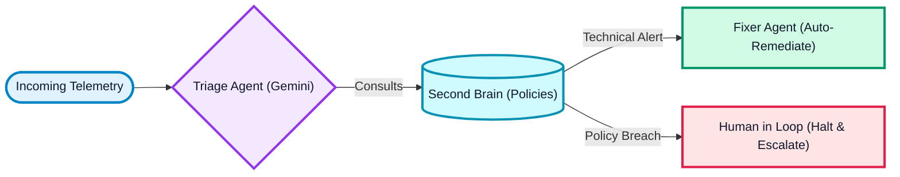

# 🚨 SRE Swarm — Autonomous Incident Response via Google ADK
 
> _What if your on-call engineer was an AI that never sleeps, reads every runbook instantly, and coordinates a team of specialists in seconds?_
 
**SRE Swarm** is a cloud-native autonomous multi-agent system built on the **Google Agent Development Kit (ADK)**. It triages payment gateway incidents, looks up runbooks from a "Second Brain" knowledge base, and executes remediation steps—all powered by **Gemini 2.5 Flash via Vertex AI**.

---
 
## 🧠 Meet the Agents
 
Powered by Google ADK's `llmagent` framework, each agent is a specialist:
 
| Agent | Role | Capability |
| :--- | :--- | :--- |
| **Triage** | The Orchestrator | Analyzes incoming signals, reads runbooks, and delegates to specialists. |
| **Fixer** | The Remediator | Executes automated fixes (e.g., restarting K8s pods) based on runbook instructions. |
| **Alerter** | The Messenger | Notifies human teams via Slack and manages high-value escalation protocols. |
 
---
 
## 🗺️ Decision Flow
 
When an alert triggers, the **Triage** agent consults the "Second Brain" and routes the incident:
 


**📝 Global Policy Overrides**
- **High-Value Payments:** Amounts > £5,000 force an immediate human escalation.
- **Weekend Guardrail:** Weekend payments are automatically deferred to Monday.
 
---
 
## ⚡ Quick Start
 
### 1. Prerequisites
- **Go 1.22+**
- **GCP Project** with **Vertex AI API** enabled.
- **Application Default Credentials** (`gcloud auth application-default login`).
 
### 2. Configuration
Create a `.env` file in the root:
```env
GOOGLE_CLOUD_PROJECT=your-project-id
GOOGLE_CLOUD_LOCATION=us-central1  # or your preferred region
```
 
### 3. Launch the Swarm
```bash
# Terminal 1: Start the mock payment gateway
cd cmd/payment-api && go run .

# Terminal 2: Start the ADK agent swarm
cd cmd/sre-swarm && go run .
```
 
### 4. Open the Dashboard
Visit **http://localhost:9090** to simulate incidents and watch the swarm reason in real-time.

---
 
## 🔧 Under the Hood
 
- **Google ADK-Go**: Uses the official `google.golang.org/adk` SDK for agent orchestration and tool usage.
- **Vertex AI / Gemini 2.5 Flash**: Optimized for low-latency, high-accuracy reasoning across thousands of tokens of runbook context.
- **Second Brain Pattern**: The AI doesn't memorize fixes; it reads Markdown files in `knowledge/` at runtime, ensuring logic can be updated without code changes.
- **Streaming Logs**: Uses Server-Sent Events (SSE) to stream the AI's internal "thinking" processes directly to the UI.

---
 
## 🎯 Why This Exists
 
Traditional SRE automation is brittle (if-this-then-that). **SRE Swarm** brings:
- **Resilience**: Agents handle unexpected drift by reasoning through documentation.
- **Speed**: Triage happens in sub-5 seconds, compared to minutes for human on-call.
- **Safety**: Human-in-the-loop triggers are built-in for high-risk compliance (AML) or scheduling (Weekend) logic.
- **Cloud-Native**: Fully integrated with the Google Cloud ecosystem via Vertex AI.
