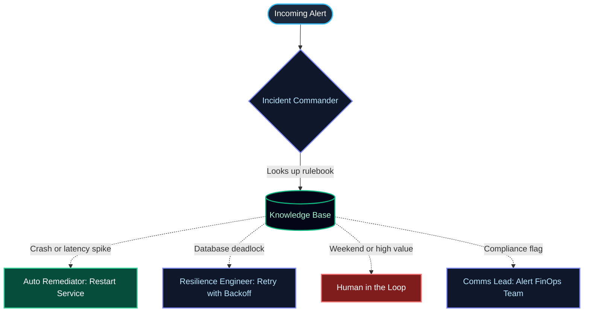

# 🚨 PaymentGuard — Autonomous AI Agents for Payment Infrastructure

> _What if your on-call engineer was an AI that never sleeps, reads every runbook instantly, and coordinates a team of specialists in seconds?_

**PaymentGuard** is a team of AI agents that monitor a payment system, detect failures, look up the right fix from a knowledge base of plain Markdown files, and either fix the problem automatically or call the right human. Everything runs locally — no cloud APIs, no API keys — and streams live to a dashboard you can watch in real time.

---

## 🧠 Meet the Agents

| Agent | Role |
| :--- | :--- |
| **Incident Commander** | The brain. Reads incoming alerts, consults the rulebooks, and decides what happens next. |
| **Auto Remediator** | The hands. Restarts crashed services without waiting for a human. |
| **Resilience Engineer** | The strategist. Handles tricky problems like database deadlocks using smart retry logic. |
| **Comms Lead** | The messenger. Alerts humans via Slack or Jira when the AI can't (or shouldn't) act alone. |

---

## 🗺️ Decision Flow

This is how the agents coordinate. The **Incident Commander** reads the rulebooks, then delegates to the right specialist based on what it finds:



---

## ⚡ Quick Start

You need **Go**, **Ollama**, and the **Gemma 4 (26B)** model.

```bash
# 1. Pull the model (one-time setup)
ollama pull gemma4:26b

# 2. Start the mock payment backend
cd cmd/payment-api && go run main.go

# 3. In a new terminal — start the agent orchestrator
cd cmd/sre-swarm && go run main.go

# 4. Open the dashboard
open web/index.html
```

Pick a failure scenario from the dropdown, hit **Initiate Autonomous Swarm**, and watch the agents reason, delegate, and resolve — all streamed live.

---

## 🔧 How It Works

```
You trigger a failure  →  Incident Commander reads the rulebook
                          →  Decides: auto-fix? escalate? retry?
                              →  Hands off to the right agent
                                  →  You watch it happen live
```

The key idea is the **knowledge base** — a folder of plain Markdown files (`knowledge/`). The AI reads these at runtime to decide what to do. Edit a rule in the Markdown and the AI's behavior changes instantly. No retraining, no redeploying.

---

## 📁 Project Layout

```
├── cmd/
│   ├── payment-api/     # Mock payment backend
│   └── sre-swarm/       # Agent orchestrator server
├── internal/agents/     # Agent definitions & tools
├── knowledge/           # Markdown rulebooks (the AI's "brain")
├── pkg/adklite/         # Lightweight agent framework
├── web/                 # Dashboard UI
└── docs/                # Architecture diagrams & walkthrough
```

---

## 🎯 Why This Exists

Most AI agent demos are slow Python scripts calling cloud APIs. This one is different:

- **100% local** — runs on your machine with Ollama. No API keys, no cloud bills.
- **Fast** — written in Go. Talks directly to Ollama over HTTP.
- **Realistic** — models real payment failures (crashes, deadlocks, compliance flags).
- **Easy to customize** — edit a Markdown file to change how the AI makes decisions.

---

## 📚 Key Concepts & References

This project draws on two ideas:

- **Karpathy's Second Brain / Librarian Pattern** — Instead of fine-tuning, the AI dynamically loads relevant Markdown documents into its context at query time. This makes the system easy to update and fully transparent.  
  → [Karpathy's Instructions for Building an AI-Driven Second Brain](https://techstrong.ai/features/karpathys-instructions-for-building-an-ai-driven-second-brain/)

- **CaVEMan Protocol** — Agent prompts are written in terse, abbreviated "caveman" style to minimize token count and maximize inference speed on local models.  
  → [CaVEMan on GitHub](https://github.com/cancerit/CaVEMan)

---

## 📖 Further Reading

See [`docs/user_guide.md`](docs/user_guide.md) for detailed architecture diagrams and a full walkthrough.
