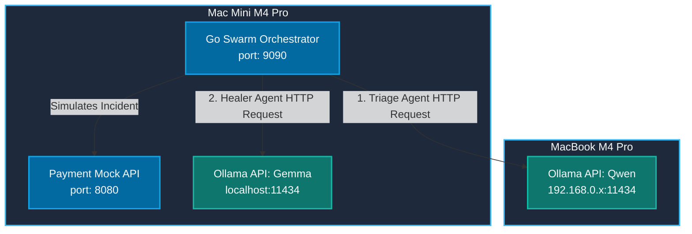
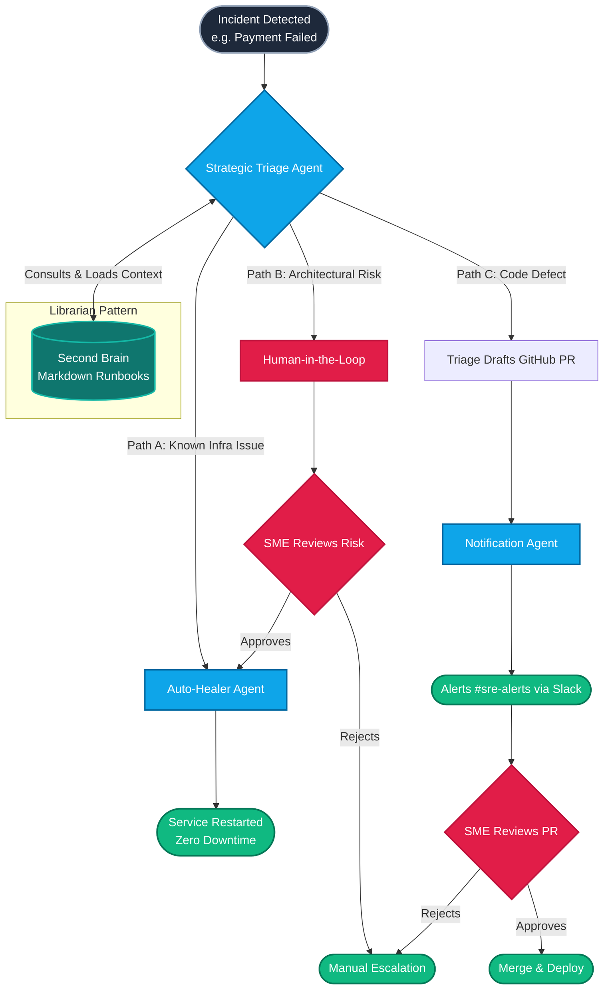

# User Guide: Autonomous SRE Protocol-Driven Swarm

This guide explains the architecture of the Go-based Autonomous SRE Swarm demo, featuring **Mermaid diagrams** to help you explain the flow to your audience.

---

## 1. Physical Infrastructure Setup (The Intelligence Mesh)

You are running this decentralized swarm across two physical machines using local Ollama instances. The Go orchestrator runs on your Mac Mini.



### Required Network Configuration
Because the Go orchestrator on the Mac Mini needs to talk to the MacBook over Wi-Fi, you must bind Ollama on the MacBook to the public network interface:
1. On your **MacBook**, start Ollama with:
   ```bash
   OLLAMA_HOST=0.0.0.0 ollama serve
   ```
2. On your **Mac Mini**, you can just use `ollama serve` normally (since the `HealerAgent` accesses it via `localhost`).

---

## 2. Product Logic Flow (User Journey)

This diagram is designed for product managers and stakeholders to quickly understand the business value and decision-making logic of the Swarm, stripping away the technical implementation details.



---

## 3. Technical Swarm Orchestration Sequence

This diagram illustrates exactly how the Go code and the LLMs execute the logic shown above.

```mermaid
sequenceDiagram
    autonumber
    
    box rgb(30, 41, 59) "Client & Mocks"
        actor UI as Web Dashboard
        participant API as Mock Payment API
    end

    box rgb(15, 23, 42) "SRE Swarm Core"
        participant Go as Go Orchestrator
        participant KB as Second Brain
    end

    box rgb(17, 24, 39) "Local LLMs"
        participant Triage as Strategic Triage
        participant Healer as Auto Healer
        participant Notification as Notification Agent
    end

    %% Incident Generation
    UI->>API: Inject Incident (e.g. Memory Leak)
    API-->>UI: Incident Registered
    
    %% Orchestration Begins
    UI->>Go: Trigger Swarm
    Go->>Triage: Investigate Error Code
    
    %% Librarian Pattern
    Note over Triage, KB: 🧠 Librarian Pattern: Load Runbooks
    Triage->>KB: CALL_TOOL: ReadKnowledgeBase
    KB-->>Triage: Inject Markdown into Context
    
    %% Decision Trees
    rect rgb(6, 78, 59)
    Note right of UI: PATH A: Auto-Remediation
    Triage-->>Go: HANDOFF: Auto_Healer
    Go->>Healer: Exec: Restart Service
    Healer-->>Go: Success
    Go-->>UI: ✅ Autonomous Resolution
    end

    rect rgb(127, 29, 29)
    Note right of UI: PATH B: Architectural Risk
    Triage-->>Go: HANDOFF: Human_in_Loop
    Go-->>UI: ⚠️ Awaiting SME Approval...
    UI-->>Go: 👤 Human Approves Bypass
    end

    rect rgb(127, 29, 29)
    Note right of UI: PATH C: Code Defect (PR Review)
    Note over Triage, UI: Triage Drafts PR with Code Fix
    Triage-->>Go: HANDOFF: Notification
    Go->>Notification: Send Slack Alert
    Notification-->>Go: Alert Sent
    Go-->>UI: 📝 PR Drafted. Awaiting SME Review...
    UI-->>Go: 👤 Human Approves PR
    Go-->>UI: ✅ Code Merged & Deployed
    end
```



---

## 3. How was it implemented so quickly?

Rather than using massive, bloated node/python frameworks, the core of this system is a custom, lightweight orchestrator (`internal/agents/agents.go`) that implements the exact primitives from your Google ADK slide:
- **Agents** (`Strategic_Triage`, `Auto_Healer`) hold instructions, host IPs, and a list of Tools.
- **Context/Knowledge** is dynamically loaded by the agents reading your markdown files.
- **Direct LLM Communication**: The `Swarm.Run` method directly formats the agent's instructions and the available tools into a JSON payload and sends it to the respective Ollama API (`/api/chat`). This approach removes overhead, makes the code blazingly fast, and is very easy to explain in a code review during your presentation.
